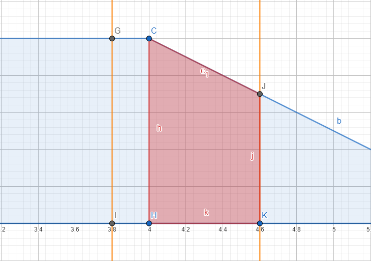
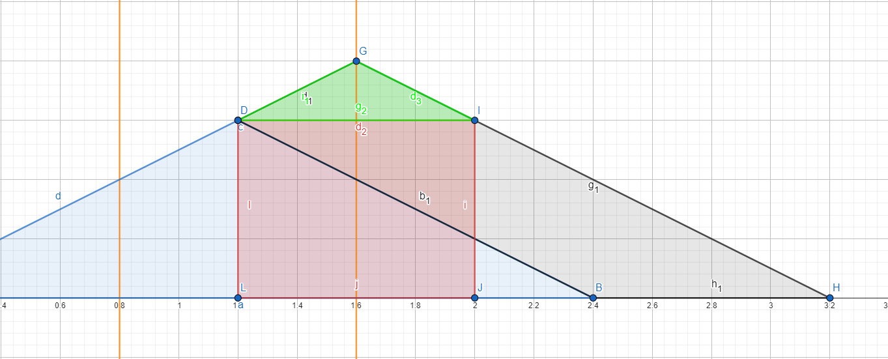

# Interpolation

If you're here. I'm so sorry.

This document will try to describe the algo idea behind the Interpolation class, in case i'll have to retouch (sigh) it in some years to make modifications.

The interpolation code actually just modifies the current acceleration and the currentspeed. The movement is obtained directly from the current speed. 

We have a base interpolation code that just works™, and then a sort of modules added in the middle of the Update() function that implements functionalities to get better results

If you need any kind of help you can contact directly me, the creator of all of this hell, here: https://stranck.ovh#contacts

Sorry for my dumb english. Forgive me. I'm italian.  


Oh. Enjoy _Comic Sans_!

## Known bug or limitations:
- When moving for small distances, we don't fully replicate what a real light would do: we just put a cap on our speed, instead of predicting the movement from the values we're getting. See more in [Cap speed on small movements](#Cap-speed-on-small-movements)
- If, between a frame and another, we should have fully stopped and then we should've started accelerating again in the opposite direction, we split the movement in two ticks instead of doing them all together. In the first one we fully stop, in the second one we move again in the opposite direction

# Base Idea

When we create the interpolation class we set two parameters:
- `acceleration` as how much speed we gain/loose every second
- `maxPhysicalSpeed` as how much distance we travel every second when we are at maxSpeed

We can set these by using the `setFadeAndAcceleration()` function, that will also set the `realFade` attribute that will be useful later


Internally our speed is saved as a (normalized) float that goes from 0 to 1. `acceleration` referes to that variable.  
Normally our speed, will look something like that:

  
_on the y axys our speed, on our x axys the time_

So, we accelerate (gain speed), we reach maxSpeed (when speed = 1), then we decelerate. The area of the polygon we're drawing is the amount of space we're gonna travel (It's an integral! :DD). Our main goal is know when we have to start decelerate to reach a full stop status with the correct amount of distance traveled so far.

The update of our position, speed and acceleration is done inside the `Update()` function that may be called at irregular intervals of time. We don't save how much time it passed since the "start", the Update function takes in input the amount of time that passed since the last time it was called. We refer as **tick** or **frame** the moment when we call Update(). Since the moment when we have to start decelerate or the moment when we reach a constant speed may be between a tick and another (like in the following image) we need to take some precautions in the code. 


The interpolation can run in both directions and, where needed, can stop and then restart in the opposite direction as well. In our algorithm description we will assume we're running ONLY in the `FORWARD` direction. `currentAcceleration` and `currentSpeed` will have their sign inverted when we're running `BACKWARD`s. In our examples, when  `currentAcceleration` is positive it means we're accelerating, when is negative it means we're decelerating. 

In the Update function and when setting TargetValue, acceleration and max speed we aquire a lock to ensure that all operations are atomic

There are few concepts that are recurrent in the algorithm:
- **timeToFullyAccelerate (TTFA):** (as well as decelerate). This is the time that our acceleration will take to get from speed = 0 to speed = 1 (and vice versa). To get the time we need to fully decelerate or fully accelerate from a _random_ speed, we just need to do a proportion: `timeToFullyAccelerate : normalizedSpeedRange = x : currentSpeed`. Since normalizedSpeedRange is equal to 1 (our speed goes only from 0 to 1!), we just need to multiply the current speed to the time to fully accelerate: `timeToReachSpeed = timeToFullyAccelerate  * currentSpeed`  
  
- **converting from normalized to physical speed:** We just need a proportion! `currentNormalizedSpeed : maxNormalizedSpeed = x : maxPhysicalSpeed`. Since our maxNormalizedSpeed is equal to 1, we just need to multiply the currentNormalizedSpeed with maxPhysicalSpeed. This applies to EVERYTHING. Also for converting distances

## Update function

_I numbered the steps in the algorithm so when explaining the extra quirks we added to get better results I can clearly point to where they've been added_

_In the [Code](#Code) section of these docs you can find screenshot from the actualy cpp code showing clearly where each point resides_

**1\)** At the start of the Update function we immediately check if our CurrentValue has met TargetValue. If yes, we return.
**(2)** Otherwise, we check whenever the interpolation is enabled. If not, we jump directly to TargetValue and we return.

From now on, it's the real™ algorithm™

**3\)** First of all, we calculate the distance we've travelled since the last tick using [`calcNextMovement()`](#calcNextMovement\(\))


**4\)** Then we calculate how much distance we will travel if we start decelerating from the current frame using [`getStopDistance()`](#getStopDistance\(\))


**5\)** Then we check if we're stopped or not. 

**6\)** If we're stopped, we first check if we've reached TargetValue. If yes, **(7)** we end the interpolation.
If not, **(8)** we calculate the new interpolation direction (forward or backward) and **(9)** we forcefully start the interpolation (See later)

If we're not stopped, **(10)** we check if the _point 4_'s distance is bigger then the difference between the CurrentValue and the Target Value. If yes, **(11)** it means that we have to start decelerate, or at the next tick we will pass over TargetValue.


**12\)** At this point, we check for our status (Where status means if we're decelerating (`status = false`) or not (`status = true`)). If it changed, **(13)** we check the status to know if we have to start accelerating (by setting the `currentAcceleration` to `acceleration`) or if we have to start decelerating (by setting the `currentAcceleration` to `-acceleration` _(IT'S NEGATIVE!)_).

**14\)** In the end, we check if the interpolation is done (By checking (if we don't have speed AND we reached target value) OR we're stopped), jumping in case to target value and returning, **(15)** we add the distance travelled since the last tick that we've calculated previously to our Current Value, and we're done.

## calcNextMovement()

This functions updates our speed based on the current acceleration and returns the amount of space we have travelled since the last tick. To actually calculate the space we use [`__calcNextMovement_internal()`](#__calcNextMovement_internal\(\))

Initally we check if we're at constant speed. 

If not we update our current speed as `newSpeed += acceleration * DeltaSeconds` and later we check if the new speed is outside of the [0, 1] boundries. If yes, it means that the tick was called too late than the moment when the interpolation has physically hitted the 0 or 1 bounds (like in the images below) and we have to correct that, otherwise we'll end up with too much speed. 


The first thing we do is clamping our speed, then we calculate, starting from the previous frame, in how much time we will hit the boundary: We first get how much speed is remaining before hitting the boundary, then we convert it in the time to fully accelerate or decelerate. 

Now, if we've hitted the 0 boundary (so we're stopping) we just call [`__calcNextMovement_internal()`](#__calcNextMovement_internal\(\)) only using the previous frame's speed and the newly calculated deltatime, since once our speed reaches 0 we don't move anymore

_This is the area we're calculating:_  


If we've instead hitted the 1 boundary (we've reached max speed) we do two things:

- We calculate the area until we reach the boundary as previously  
  
- Then we update the local DeltaTime to the remaining time from the moment we have reached the boundary to the current tick, so the function will normally do its job calculating the movement  


After all of that we check if we're moving. If yes, we add to any previously calculated movement, the result of [`__calcNextMovement_internal()`](#__calcNextMovement_internal\(\)) called with the Deltatime (that can be modified from the previous code). If previously we've hitted the 0 boundary, we're not moving anymore, so this function will not be called

## __calcNextMovement_internal()

This function calculates the amount of space we've travelled in DeltaTime starting from the previous speed and ending with the CurrentSpeed

The first thing we do is calculating the area of a rectangle with the height equal to the previous speed


This works well if we have a constant speed, but what if our speed is changing?
In that case, we can see our polygon as the sum of a rectangle (with the height equal as the previous speed) and a triangle on top with the height equal to the difference between the previous and the current speed


So our code, after getting the area of the rectangle, checks if we're not at constant speed (so our previous speed differs from the current speed) and, in case, sums the area of the triangle to the previous one. This works also when we're decelerating, since the area of the triangle becomes negative (because we ALWAYS do `currentSpeed - previousSpeed`) and we're actually subtracting it from the area of the rectangle


## getStopDistance()

This function is pretty straight forward. We simply return the area of a triangle that has the current speed as height and the time to decelerate starting from the current speed as base


# CompensateLateCall (on starting deceleration) 

Sometimes it may happen that the moment when we had to start decelerating is between this and the previous tick. In the current implementation we start decelerating in the current frame. This is hella wrong, since we end up in a good 95% of the cases with too much travelled distance and we surpass target value


  
_in grey: the extra distance we erroneously travel_

This quirk will require rollbacking to the acceleration and speed status we had before we firstly call [`calcNextMovement()`](#calcNextMovement\(\)) in the point 3 of the Update function. So we move the currentAcceleration and the currentStatus in a separate struct and we save it in a local variable before the point 3.

The code of this quirk will be executed only when weneed to start to decelerate and before we actually change the acceleration (So between the points 12 and 13). There are also a few more conditions for getting this code to run. This is an exaustive list of them:
- Our status is changed
- We're decelerating
- If, by starting decelerating in this frame, we'll surpass TargetValue
- We've not surpassed TargetValue

The code is implemented inside the `compensateLateCall()` function and works as follows:

We firstly check if in the previous frame we were accelerating and in the current frame we're at max and constant speed. If yes it means that between this and the previous frame we have reached max constant speed and we need to change the function's argouments to have correct results. We can have two different cases: The moment when we had to start decelerating is BEFORE we reach max speed, and AFTER we reach max speed. We first obtain the remaining time we need to reach max speed, then we call [`__calcNextMovement_internal()`](#__calcNextMovement_internal\(\)) to get the distance we would travel before hitting max speed _(The area in red in the following image)_ and we sum it up together with our CurrentValue and the stopDistance with speed = 1 _(The green area in the following image)_. This will give us the distance we will travel if we let our speed reach 1 and then we start decelerating from that moment.


Then we check if that sum is bigger or lower TargetValue.

If it's bigger it means that we had to start decelerating before hitting max constant speed. So we recalc the distance difference as the previous sum and the TargetValue

  
_In grey the new distance_

If it's instead smaller, it means that we have to start decelerating after we hit max constant speed. We keep the same distance as before, but we modify the function's argouments to trick the following code that previously we already were at constant speed


We then transform the distance difference between our target value and where we'll stop if we start decelerating in this frame, to a normalized distance by dividing it for our `maxPhysicalSpeed`. 
Then we calculate using [`getCorrectStopTimeDelta()`](#getCorrectStopTimeDelta\(\)) the moment between this and the previous tick when we had to start decelerating


If that moment comes out as a negative value, it means that we needed to decelerate BEFORE the previous frame. But since the previous frame hasn't entered a deceleration status, it means that during the previous frame the TargetValue was farther than now. This only means that between the preivous and the current frame the **Target value has changed**, decreasing it's value. In this eventuality, we do not compensate the late deceleration call, and we leave this job to [OverrideDeceleration](#OverrideDeceleration).

Anyway, if the previous time is positive, we rollback to the previous frame's acceleration and speed values (Invalidating everything we've done in the current frame), then we calculate the movement until the moment when we had to start to decelerate and we add that movement to our curent value


Then we update the DeltaTime of the Update function to let it calculate the rest of the movement and we return

There's another addiction in the Update function immediately after we change our acceleration value (So immediately after the 13rd point): If we have successfully compensated a late call in the previous function, we calculate again the next movement _(the red area in the following image)_



## getCorrectStopTimeDelta()

This function calculates how late we called the current tick respect to the moment when we had to start decelerating. It trasforms the distance difference between the stop position and target value in time difference. It has two main cases: when we previously were at constant speed and when we previously were accelerating

### **- Constant speed**

We should imagine the distance difference as a simple parallelogram which has in height the current (and previous) speed and as base the difference in time


Since,

The area of the said parallelogram _(KNOWN, it's the distance difference)_ = the base _(it's the time difference)_ * the height _(KNOWN, it's the speed)_

We can simply calculate (and return) the time difference with `area / height = distanceDifference / speed`

### **- We were accelerating**

Here the things are a little bit more complicated, because the distance difference assumes a rotated trapezoidal shape and it's base or height doesn't match any of the values we already have, so we cannot use any king of inverse formulas


Actually, the area of this shape is equal to the area of a rectangle that has as base the double of the difference in time and as height the speed we have in the moment when we had to start decelerating, and on top a isosceles triangle that shares the same base with the rectangle and has height eqyals to `the base * the interpolation's acceleration`



Let's do some math™

```
y = ratio
heightT = y/2*x
base = x
areaT = base * heightT *  1/2 = y/2 * x^2 * 1/2 = y/4 * x^2
heightR = z
areaR = base * heightR = x * z

area = areaT + areaR = y/4 * x^2 + x * z
totalHeight = heightT + heightR = y/2 * x + z

; Then we put these two formula into a system and we end up with

/  y/4h * x^2 - x + a/h = 0 -> y/4 * x^2 - h * x + a = 0
\  z = h - y/2 * x
;(where h is totalHeight and a is area)
```

So, by solving the second grade equation `ratio/4 * x^2 - currentSpeed * x + distanceDifference = 0` for x we'll obtain the base of that polygon, that's equal to the difference in time we're searching. If we're moving forward we'll find our correct result inside `x1 = (-b + sqrt(delta))) / (2 * a)`; if we're running backwards we'll find it inside `x2 = (-b - sqrt(delta))) / (2 * a)`.

In both cases, because the time difference actually is equal only of the half of the base of that polygon, we divide the result per 2. Also, this equation will give us negative numbers, so we also invert the sign of the result to get the correct time

  
_The time offset we're searching equals only to half of the time difference_

# OverrideDeceleration

It may happen that between the frame when we start decelerating and the frame before, TargetValue changes. It may also happen that TargetValue changes when we're already decelerating. In both cases, when TargetValue becomes closer to CurrentValue (so it goes back) we prefer to decelerate faster over to stopping after TargetValue and then moving back. 


The code responsible for overriding the deceleration is located after every calculation in the Update function, so immediately before point 14, and it's run only if the following conditions are met:
- We've not run CompensateLateCall OR it has failed
- We're now decelerating
- Target value has changed since the last frame
- Our stop position surpasses target value

The main difference between this and CompensateLateCall is that this is actually called if the moment when we had to start to decelerate is previous the previous tick. This happens only when TargetValue changes, since if it remained still the deceleration-start would be "captured" from the previous frame. This function exists, because we can't go back in time and change how the previous frame acted, so CompensateLateCall can't do its job and the only choice we have left is actually decelerating faster

_What we_ should _do but we can't since we cannot go back in time and change the previous frame's behaviour_  
  

_What we actually do_  
  


The code firstly calcs a new deceleration value and overrides it calling [`overrideDeceleration()`](#overrideDeceleration\(\)), then it rollbacks the speed and the movement to the previous frame, and calculates a new movement using the overriden deceleration (starting from the previous tick, so the deceleration is less aggressive)

Since we rollback and we start decelerating from the PREVIOUS frame, to calculate the correct modified-deceleration we need to know what was the stop distance in the previous frame. We added a [`getStopDistance()`](#getStopDistance\(\)) call before the point 3 of the update function to keep that value.

But what happens if the target value changes again when we're already overriding the deceleration? We simply recalc againg a new deceleration value and override it again. So our deceleration can both increase and decrease while we're already are slowing down, eventually reaching the max ratio or coming back to the original deceleration

  

## overrideDeceleration()

This function takes in input the previous stop distance and the previous speed and uses them together with TargetValue to calculate a faster deceleration value.

Since physically a light cannot decelerate too much fast, we have a max modified-deceleration cap, that's currently hard coded as `interpolation's acceleration * MAX_FAST_DECELERATION_RATIO`. You can find the `MAX_FAST_DECELERATION_RATIO` macro at the start of the .cpp file and it's currently set to 1.5

The code works as follows:

We first get the absolute value of the normalized distance between the previous stopDistance and the TargetValue. Then we convert the difference in distance in a difference in time, using the reverse formula to calculate the base (time difference) of a triangle from its area (distance difference) and its height (previousSpeed)


Then we get the time to fully decelerate from the previous speed and we subtract the time difference, to get the time we need to fully stop using the overriden deceleration


Now it's finally time to calc the deceleration. If we imagine intersecting the moment when we start to decelerate with our previous speed _(Point C in the previous image)_ and intersecting the moment when we reach 0 speed with `y=0` _(Point G in the previous image)_ as two points, our deceleration ratio is the coefficent of a line passing between these two points.


If we assume that the first point resides when time=0, we get our points at coordinates `P1 = (x: 0, y: previous speed)` and `P2 = (x: time to fully stop with new deceleration, y: 0)`. Now we can use the formula `(y2 - y1) / (x2 - x1)` to get the coefficient. Since we have x1 and y2 equals to 0, we can simplify it in `-y1/x2`, that, in our calculations, it's `-prevSpeed/newStopTime`


There are some instances when we have to cap our new deceleration to our max deceleration. We cap it when one of these conditions are met:
- newDeceleration is bigger then the max deceleration
- Our current value has surpassed target value. This means that target value changed behind the current value and we MUST slow down as fast as we can and then moving back
- The new stop time is negative, meaning that we should've stopped before the previous frame, so we simply stop as fast as we can

# Cap speed on small movements

When the TargetValue updates of a small amount a real light would not move as fast as a normal movement, but will instead reach the target value much slowly. This is particularly useful for long movements with a slow fade, when the target value is constantly updated by just a tiny bit. Using the normal speed in faster lights may cause the movement to do small snaps instead of a fluid movement.

To obtain this effect real lights try to predict the movement that the console is sending out and they change their speed according to that, however we go for a simpler approach that's still effective. The idea is to, each time we update Target value, calculate in advance how much time we need to fully complete the movement (considering our current value, the new target value and our current speed) and if it's under a threshold (equal to the minimum between the RealFade of the interpolation multiplied with `MIN_MOVEMENT_REALFADE_RATIO` and `MIN_MOVEMENT_TIME` (both defined in the top of the .h file, currently set to 0.55 and 0.7)) we cap our max speed so our movement will take _threshold_ time to be done. The speed cap is actually done overriding the acceleration to 0 when we reach the correct speed


This functionality is active and can only work if the RealFade value is set in the interpolation object. It's automatically set when you call `setFadeAndAcceleration()` and removed each time you call `setMaxSpeed()` or `setAcceleration()`.  
**You can disable this functionality** by setting to `false` the attribute `bSpeedCapEnabled`


We've modified both Update loop and the SetTargetValue functions. In the Update loop we placed the code to actually cap the speed between the points 11 and 12, after we've decided if we still need to run or we have to start decelerate. In the SetTargetValue function we placed the new code to choose the speed cap at the end of the function

### The code in the SetTargetValue function works as follows:

We first get the normalized distance between the current and the target value, and the max time threshold (as `Min(MIN_MOVEMENT_TIME, realFade)`). Then we call [`getTimeToMoveThruRange()`](#getTimeToMoveThruRange\(\)) to obtain the time we need to reach TargetValue considering our current value and our current speed. If we need less time than the threshold we calculate and set the speed cap in [`setMaxNormalizedSpeedFromTimeAndRange()`](#setMaxNormalizedSpeedFromTimeAndRange\(\)), otherwise we disable the speed cap

_What we normally would do_  
  

_What we do by capping speed_  
  

### The code in the Update loop works as follows:

First of all, we check if the interpolation is not decelerating because our stop position is over target value. If not, we check if we've set a speed cap or not.

If we've not set a speedcap, we check if also in the previous frame we was not decelerating and if the acceleration is overridden to 0. If yes, it means that we've previously reached a speedcap (only the speedcap can ovveride the acceleration to 0!) and between this and the previous frame the TargetValue was updated and the cap removed, so we disable the acceleration override to come back accelerating again


If a speedcap is set we can do three different actions:
- **1 - If our speed reeached the speedcap:** Override the acceleration to 0 so our speed doesn't change
- **2 - If our speed is over the speedcap:** Force a deceleration until we reach the speedcap and we fall in the previous case. This covers the case when our speedcap changes to a lower value
- **3 - If our speed is under the speedcap and we previously reached another, lower, speedcap:** Disable the acceleration's override, so we accelerate again until we reach the speedcap

_Case 1_  
  

_Case 2_  
  

_Case 3_  
  

The case when our speed is under a speedcap and we've not reached another speedcap is not covered, since we're already accelerating. We don't need to cover the cases when we start "naturally" decelerating since setting a new acceleration value will remove the acceleration override.

## getTimeToMoveThruRange\(\)

This function takes in input our current value, our current speed and our target value, and returns the amount of time needed to complete the movement and reach TargetValue. 

Let's imagine dividing our movement in 3 sections: acceleration (also called `T1`), constant speed (also called `R`), deceleration (also called `T2`)


_When our current speed is not 0, T1 will be spliced at the start like this:_  


We firstly obtain the movement's range as the absolute difference between current and target value.

Then the function checks if, during the entire movement, we hit or not maxSpeed, and, based on that, makes different calculations to obtain the total time.

It does that by calculating the whole T1 + T2 area and then checking if it's less of the range. If our current speed is bigger then 0, we obtain the real T1+T2 area by subtracting from it the area of a triangle we can build using the time to reach the current speed as base and the current speed as height.

_What we do when currentSpeed == 0_  


_What we do when currentSpeed > 0_  


**If this area is less or equal than the range** it means that we're going to hit maxSpeed in our movement, because after accelerating and decelerating we still have some movement left to do. We calculate the total time as the sum of the time needed by each section of the movement:
- **T1:** it's timeToFullyAccelerate - the time to reach current speed
- **T2:** it's just timeToFullyAccelerate
- **R:**  it's the inverse formula to get the base of a rectangle from its area and height. We obtain the area of the constant speed section as `the range - the previous T1+T2 area`. Because the height when we're at maxSpeed is ALWAYS 1, the time just is "equal" to it's area


**If, instead, the previous T1+T2 area is bigger then the range** it means that during our movement we will start decelerating before hitting maxSpeed. To get our total time (assuming that curentSpeed = 0) we have to solve a simple equation:

```
; h: speed when we will start decelerating, equals to the height of T1
; b: time to reach `h`, equals to the base of T1
; R: acceleration, equals to the ratio between `h` and `b` (KNOWN)
; A: T1+T2 area (KNOWN)

h = Rb            ; define ratio between h and b 
A = 2b * h / 2    ; area of T1 and T2 is define as two times b, since we want the whole area and b refers only at the base of one of T1 and T2

; We solve the equation for b

2A = 2b * Rb
2A = 2Rb^2
2A/R = 2b^2
A/R = b^2
b = sqrt(A/R)
```

We got the formula `timeToReachH = sqrt(range / acceleration)`. Since we want to accelerate, reach H and then decelerate back, we have to double the time, so we get the formula `totalTime = sqrt(range / acceleration) * 2`


And if our current speed is bigger than 0? We can use the previous formula with two quirks: To obtain the T1+T2 area we take our range and we add the area of the splice to reach the current speed (prevArea). At this point, using the previous formula we obtain the total time like if our current speed was still equal to 0. To get the real total time, we simply subtract the time to reach the current speed. The final formula is `totalTime = sqrt(range / acceleration) * 2 - timeToReachCurrentSpeed`


## setMaxNormalizedSpeedFromTimeAndRange()

This function takes in input a desideredTime and the range between currentValue and Target value, and sets a speedCap so the movement through the entire range takes exactly the desidered amount of time.

Let's take the same section of the movement described in the [`getTimeToMoveThruRange()`](#getTimeToMoveThruRange\(\)) function and let's say that X is the output speed we want to obtain


The previous image shows clearly what we're trying to obtain. In red we have the original movement, in green we have a new movement speedcapped (with X = 0.5229670385731), so it leasts exactly 3 seconds. Let's breakdown how the green polygon is made:
- The base of T1 is equal to the absolute difference between the time to reach currentSpeed and the time to reach X
- The base of T2 is equal to just the time to reach X
- The base of R is equal to the total time minus the bases of the two T1 and T2
- The area of T1 is obtained like in the [`__calcNextMovement_internal()`](#__calcNextMovement_internal\(\)) function: We first get the area of the rectangle with height = currentSpeed, and then we add the area of the triangle on top of it that has the height equal to the difference between x and the current speed
- The area of T2 is obtained like a normal triangle's area formula: Bt1 _(base)_ * x _(height)_ / 2
- Thea area of R is obtained as well like a normal rectangle's area: Br * x

```
; a: timeToFullyAccellerate
; Bt1, Bt2, Br: Base of T1, T2 and R
; At1, At2, Ar: Area of T1, T2 and R
; At: Total area
; p: CurrentSpeed
; T: totalTime
; x: speedCap

Bt1 = a * |x - p| = |ax - ap|
Bt2 = ax
Br = T - Bt1 - Bt2 = T - Bt1 - ax

At1 = pBt1 + ((x - p) * Bt1) / 2
At2 = (Bt2 * x) / 2 = ax^2 / 2
Ar  = Br * x = Tx - Bt1x - ax^2
At  = At1 + At2 + At3 = (pBt1) / 2 - (xBt1) / 2 - (ax^2) / 2 + Tx 

(pBt1) / 2 - (xBt1) / 2 - (ax^2) / 2 + Tx - At = 0
```

Now, we have three cases:

- CurrentSpeed is greater or equal of X. Starting from the current speed, we're going to decelerate before hitting our speed cap  
  
- CurrentSpeed is below or equal of X. Starting form the current speed, we're going to accelerate before hitting our speed cap  
  
- CurrentSpeed is equal to X. We're already at our speedcap. We can proceed with one of the previous case

Because in our equation `(pBt1) / 2 - (xBt1) / 2 - (ax^2) / 2 + Tx - At = 0` we have `Bt1` that's an absolute value, we have to solve the equation in two different ways: when we're in the first case, we substitute it with `ax - ap`; when we're in the second case we use `ap - ax` instead. 

The final equations are:
- `ax^2 + (ap + t)x + (ap^2 / 2 + At) = 0` when `x >= p`
- `(-ap + t)x + (ap^2)/2 - At = 0` when `x <= p`


The function firstly solves the second case. If the solution is not valid (x is greater then currentSpeed, or x is not in the (0, 1) boundaries) it will solve the second case. If the solution is valid (x is in the (0, 1) boundary), we set the speedcap, otherwise we do nothing. NOTE: In the second case we don't check if x actually is >= of currentSpeed because it may happen that when they're equal the float's approximations will make x just a tiny bit under current speed _(EG: x = 4.999999999999, currentSpeed = 5)_ and the solution wouldn't be considered valid. The same happens for the first case, but reversed: x is just a tiny bit over current speed

# Extra

## setFadeAndAcceleration()

This is a function that will convert `RealFade` and `RealAcceleration` GDTF parameters into the interpolation's `maxSpeed` and `acceleration` variables. It uses as input the interpolation's range (MaxValue - MinValue) to calculate the maxSpeed

GDTF's RealAcceleration is the time in seconds needed for passing from 0 to maxSpeed (SecondsPerSpeed). Our acceleration variable is the amount of speed we gain each second (SpeedPerSecond). Since acceleration is the inverse of RealAcceleration, we simply obtain it with the formula `acceleration = 1 / RealAcceleration`


GDTF's RealFade contains also the acceleration and deceleration segment of a movement. To obtain the maxSpeed we have to solve a simple proportion (we're gonna use the same nomenclature of [`getTimeToMoveThruRange()`](#getTimeToMoveThruRange\(\))):
- The area of T1 or T2 is equal to `RealAcceleration * maxSpeed / 2`. Because maxSpeed is equal to 1 we can simplify it in `RealAcceleration / 2`. Because T1's area is equals to T2's area and are both included inside RealFade, the T1+T2 area is equal to just `RealAcceleration / 2 * 2 = RealAcceleration`
- The base of R is equal to the RealFade minus the time needed for T1 and T2, so `RealFade - RealAcceleration * 2`. We can get the area of R by multiplying the base * maxSpeed, but since maxSpeed is equal to 1, the area is actually equal to just the previous formula
- The total area is equal to T1+T2 + R, so `movTime - accelTime * 2 + accelTime = movTime - accelTime` 

So we set up the proportion `normalizedRange : maxNormalizedSpeed =  range : maxPhysicalSpeed` that's solved with `maxPhysicalSpeed = range * maxNormalizedSpeed / normalizedRange = range * 1 / (movTime - accelTime) = range / (movTime - accelTime)`


## EndInterpolation()

The end interpolation code is pretty simple. It resets our acceleration and speed to 0 and, based on the user's choice, can snap the CurrentValue to the TargetValue (so we will snap to the end) or can copy the CurrentValue to the TargetValue (so we stay still in the same position)

## Code

The following snippets show you the modified Update and SetTargetValue functions describing which are the points and which parts of the code are added for the extra quirks

### **Update function**
In red you can see the areas of the extra quirks.

In orange you can see the points


### **SetTargetValue**


## Equations