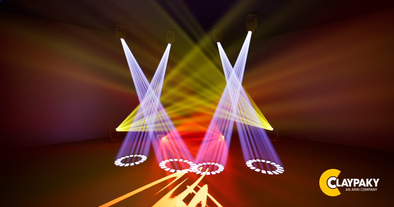

# Unreal GDTFImporter by Clay Paky

  

<h1 align="center" style="color: white !important;">Unreal GDTFImporter by Clay Paky</h1>

<h2><em><strong>WARNING :</strong></em> This plugin is still under development.
</h2>
<h2><em><strong>IMPORTANT :</strong></em> In case of fixture(s) inacurate behaviour before looking for a bug please start by checking the GDTF definition. A lot of them are bad formatted or provide values who doesn't fit the real behavior.
</h2>

## TODO

- Do the TODOs

- Improve documentation
- **Add support of multiple Color/Gobo wheels on the same fixture**
- Extract the interpolation system (FChannelInterpolation property) in an interface to avoid code duplicate
- Fix Lens texture not centered
- Add the reconfiguration of a DMXComponent (channel description and everything) on DMXAddress change.
- Add support of DMXModes on GDTF ChannelFunctions (See GDTF of Robe Pointe rotating Gobos DMX channels)
- Check the accuracy of rotation matrix parsing in ``FCPGDTFImporterUtils``
- Add missing attributes supports on Color and Gobo Wheel components
- Create generic parametric BeamType assets on unreal (See ``ECPGDTFDescriptionGeometryBeamType``)
- Manage differents DMXModes (Reconfigure Actor on Mode change)
- ADD laser support inspired by existing implementation on DMXFixtures plugin
- fix pan/tilt smooth
- linear frost?

## Idea of improvement

Add a option in the interface to ask the DMXLibrary to use and create the Fixture type automaticaly.
 To do see there =>
- UDMXEntityFixtureType::CreateFixtureTypeInLibrary
- FDMXEntityFixtureTypeConstructionParams
-	SDMXEntityDropdownMenu

## Known Limitations

Solvable
- Only one color and one gobo wheel on one fixture
- The fixtures will be configured with the first DMX mode and it can't be changed throught UI
- The DMX mode can't be changed throught UI (same problem that previous line)
- Channels modifiying the behaviour of other channels is not supported
- No support of infinite Pan/Tilt

Permanent
- Bad GDTF Files
- Impossible to render colored glass gobos on the spotlight (because an Unreal's light function only apply to the intensity)
- Incompatible with GDTF < 1.2 because of ``.3ds`` models only
- Focus not relevant because of the way of Unreal Engine render spotlights light functions.

## Features

*TODO*

## Installing

### First way 'Project Plugin'
1. If your project is open in Unreal close it.
2. Create a ``Plugins`` folder in your project folder.
3. Extract the plugin.
4. Launch the project in Unreal.
5. To confirm that the plug-in has been successfully installed and enabled, during a GDTF import the option windows should specify if this is the Clay Paky GDTF Importer.

### Second way 'Engine Plugin'
Follow the same procedure than the 'Project Plugin installation' but extract the plugin in ``<Unreal Engine Install Folder>\Engine\Plugins`` folder.

## Developement
1. Create an new empty project (Film/Video & Live Events => Blank).
2. Create a C++ class (Tools => New C++ Class).
3. Generate Visual Studio project (Tools => Refresh Visual Studio Project).
4. Open the project in Visual Studio (Tools => Open Visual Studio).
5. Close Unreal Engine.
6. Build the project (On the the Solution Explorer under the Game folder right click on the project and Build).
7. Close Visual Studio.
8. Create a ``Plugins`` folder in your project folder.
9. Extract the plugin.
10. Right click on the ``<project_name>.uproject`` and Generate Visual Studio project files.
11. Open the project in Visual Studio.
12. Build the project.
13. Now you can open Unreal Engine and try the plugin.

***Important notes:***
- To create new classes/files Visual Studio store them in wrong folders. Use the C++ class wizard on Unreal Engine (step 2) or close VS create the files at the good place and regenerate the VS project (step 10).
- ``UPROPERTY()`` macros ending with a semicolon will make Doxygen unable to generate the documentation of the property
- ``UCLASS()`` ``UENUM()`` ``USTRUCT()`` ``GENERATED_BODY()`` macros sould **NEVER** end with a semicolon
- To avoid Doxygen code parsing problems (``warning: Found ';' while parsing initializer list! (doxygen could be confused by a macro call without semicolon)``). Nested Unreal macros calls like ``UCLASS(ClassGroup = (DMX), Meta = (BlueprintSpawnableComponent))`` needs to be excluded of Doxygen parsing with ``/// \ cond NOT_DOXYGEN`` / ``/// \ endcond`` (without space after backslash)

## Generate the docs
***Requires [Doxygen](https://www.doxygen.nl/download.html#srcbin) and [Graphviz](https://graphviz.org/download/#executable-packages) installed***
1. Open a terminal in the root of the repository
2. Execute ``doxygen``
3. Open the file [Docs/html/index.html](Docs/html/index.html)

## Release new version

1. Build plugin as described in [Developement section](#autotoc_md8).
2. In the ``ClayPakyGDTFImporter`` plugin folder delete :
  - ``.git`` folder.
  - ``Docs`` folder.
  - ``Intermediate`` folder.
  - ``Source/Private`` folder.
  - ``Doxyfile`` file.
  - ``README.md`` file.
3. In the Binaries folder delete all the files except ``UnrealEditor-ClayPakyGDTFImporter.dll`` and ``UnrealEditor.modules``.
4. In ``ClayPakyGDTFImporter.uplugin`` text file edit ``IsBetaVersion``, ``Version`` and ``VersionName`` to fit the new release number.
5. Pack the ``ClayPakyGDTFImporter`` plugin folder in an archive.
6. Installation procedure explained in [Installing section](#autotoc_md5)

## Update Unreal Developement Branch
1. Close Unreal Engine and Visual Studio
2. Go to Unreal Engine folder
3. Do a ``git pull``
4. Launch ``./Setup.bat``
5. Launch ``./GenerateProjectFiles.bat``
6. Open UE5 Solution in Visual Studio
7. Build Unreal Engine
8. Open the Clay Paky project in Visual Studio
9. Build the project 